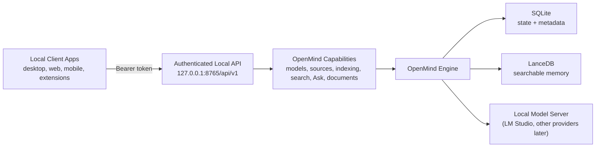

<p align="center">
  
</p>

<p align="center">
  <a href="https://github.com/codewithbro95/openmind/actions/workflows/tests.yml"></a>
  <a href="https://github.com/codewithbro95/openmind/actions/workflows/release.yml"></a>
  <a href="https://pypi.org/project/openmind-core/"></a>
  <a href="https://pypi.org/project/openmind-core/"></a>
  <a href="https://github.com/codewithbro95/openmind/blob/main/LICENSE"></a>
</p>

# OpenMind Core

OpenMind is a local AI memory engine for your computer.

It indexes folders you explicitly approve, stores searchable memory locally, and lets you search or ask questions across your own files with sources attached.

> [!IMPORTANT]
> **Official client app:** [Beignet Haricot](https://github.com/codewithbro95/beignet-haricot) is the official work-in-progress client app. It is developed separately and uses OpenMind as its local memory engine.
>
> **Build your own client:** As of [OpenMind v0.0.5](https://github.com/codewithbro95/openmind/releases/tag/v0.0.5), the core CLI capabilities are exposed over an authenticated local API. local client apps can build directly on OpenMind using the documented [API](API.md).

OpenMind is not a chatbot, desktop UI, browser extension, cloud sync service, or agent that controls your machine. It focuses on three core jobs:

```text
Index local files -> Search local memory -> Ask source-grounded questions
```

## Why am i building this?

I am building this because I have a lot of files on my computer, and sometimes I genuinely get lost. I forget a file I downloaded months ago, or something I saved years ago. sometims i just need an order id from a receipt i got last week, a flight number from a pdf, or a detail buried somewhere in my messy downloads folder or even across my system. I do not want to upload all of that to another app just to find it again, no. or even give access to my data to big tech companies. I want a local AI memory that quietly understands the folders I already have existing on my system, works in the background, and helps me ask my own computer what it already has, that's it

## What OpenMind Does

OpenMind Core is a local-first engine, CLI, and authenticated local API for indexing, searching, and asking questions over user-approved folders.

- Local app storage under `~/.openmind`.
- User-approved folder sources.
- File extraction for common text, PDF, DOCX, CSV, Markdown, HTML, and image files.
- LanceDB vector storage.
- SQLite source, file, and indexing job records.
- LM Studio as the user-facing local AI provider.
- Background indexing with live progress.
- Streaming answers by default.
- Interactive ask sessions with temporary conversation memory.
- Source-grounded answers.
- Developer log inspection.
- Versioned local API for third-party client applications.

OpenMind intentionally avoids:

- desktop UI
- browser extension
- cloud sync
- file automation
- plugin marketplace
- deleting, moving, or modifying user files

See [FEATURES.md](FEATURES.md) for the complete shipped feature list and roadmap. See [CHANGELOG.md](CHANGELOG.md) for release notes.

## Requirements

- Python 3.11+
- `uv`
- LM Studio for local chat, embedding, and vision models
- macOS, Linux, or another Python-supported environment

OpenMind currently uses LM Studio as its only user-facing provider. The older Sentence Transformers provider remains only as a development and test fallback.

## Install

Install the CLI with `uv`:

```bash
uv tool install openmind-core
```

Start setup:

```bash
openmind setup
```

You can also install it with pipx:

```bash
pipx install openmind-core
```

The PyPI package is named `openmind-core`; the command it installs is `openmind`.

## Development

For local development, clone the project and install it into your Python environment.

If you already have a conda environment named `openmind` (you can name it whatever you want):

```bash
cd openmind-core
conda activate openmind
uv pip install -e ".[dev]"
pytest
```

`uv pip install` detects the activated conda environment and installs the packages into it, while still using uv's fast resolver and installer.

To let `uv` manage the environment:

```bash
cd openmind-core
uv sync --all-extras
uv run pytest
```

Useful dependency commands:

```bash
uv lock
uv sync --all-extras
uv pip install -e ".[dev]"
```

## Quick Start

Start the LM Studio local server first. In LM Studio, open the Developer tab and start the server, or run:

```bash
lms server start
```

Run first-time setup:

```bash
openmind setup
```

Setup:

1. Initialize `~/.openmind`.
2. Check that LM Studio is reachable.
3. Let you choose a model provider (currently LM Studio).
4. Show arrow-key selectors for available chat, embedding, and image description models.
5. Load the selected models.
6. Show a checkbox selector for folders to index.
7. Start background indexing.

Use the arrow keys to move, `Space` to toggle folders in a checkbox list, and `Enter` to confirm a selection. Setup begins with the OpenMind terminal banner so it is immediately clear which application is running.

Watch indexing progress:

```bash
openmind index status
```

The live status table includes an `Already indexed` count for unchanged files that were indexed before and are still accessible.

Search your local memory:

```bash
openmind search "holiday plan"
```

Ask a question with sources:

```bash
openmind ask "What documents do I have about the cabin trip?"
```

Start an interactive ask session:

```bash
openmind ask
```

## CLI Reference

Start here:

```bash
openmind setup
```

Lower-level initialization:

```bash
openmind --version
openmind init
openmind status
openmind flush
openmind flush --dry-run
openmind flush --yes
openmind flush --yes --include-sources
openmind uninstall
openmind uninstall --dry-run
openmind uninstall --yes
openmind uninstall --yes --package
```

Source management:

```bash
openmind source add ~/Documents
openmind source list
openmind source remove <source_id>
```

Removing a source also removes its file records, chunks, and embeddings from OpenMind. The original folder and files are never deleted.

If a folder was already added, OpenMind tells you it is already registered and reports indexed files that are already accessible.

Ignore rules:

```bash
openmind ignore list
openmind ignore add path ~/Documents/Private
openmind ignore add pattern "*.backup.pdf"
openmind ignore add extension .mp4
openmind ignore add folder-name archive
openmind ignore add file-name personal-notes.txt
openmind ignore add source-type image --scope source --source <source_id>
openmind ignore add max-file-size 100MB
openmind ignore test ~/Documents/Private/notes.pdf
openmind ignore disable <rule_id>
openmind ignore enable <rule_id>
openmind ignore remove <rule_id>
```

Rules are stored in SQLite and shared by normal indexing, background Watch Mode, the CLI, and API clients. Adding or enabling a rule immediately removes matching content from searchable memory without deleting or modifying the original files.

Indexing:

```bash
openmind index
openmind index start
openmind index status
openmind index status --once
openmind index pause
openmind index resume
openmind index stop
```

If an unchanged file was indexed before, OpenMind reports it as already indexed and keeps it available for search and ask.

OpenMind uses file path, size, modified time, and content hash to avoid unnecessary work. Unchanged files are not extracted, embedded, or stored again. If a file's metadata changes, OpenMind checks the content hash and only re-indexes when the content actually changed.

Watch mode:

```bash
openmind watch
openmind watch status
openmind watch stop
```

`openmind watch` starts a detached local worker and returns control to the terminal. The worker keeps enabled source folders synchronized until `openmind watch stop` is run. New and changed files are indexed after a short debounce and stability check; deleted files are removed from SQLite and LanceDB without touching any user files.

Search:

```bash
openmind search "holiday plan"
openmind search "OAuth redirect issue" --limit 10
```

Ask:

```bash
openmind ask "What do my files say about the cabin trip?"
openmind ask "What do my files say about the cabin trip?" --no-stream
openmind ask "What do my files say about the cabin trip?" --reasoning
openmind ask "What do my files say about the cabin trip?" --limit 8
openmind ask
```

Interactive ask commands:

```text
/clear  reset the current session memory
/exit   leave the chat
/quit   leave the chat
```

Ask responses use Markdown, and the CLI renders streamed Markdown directly in the terminal. Interactive chat uses the model provider's stateful conversation support, so follow-ups continue from a provider response ID instead of resending the full model conversation. OpenMind runs a fresh vector search for every message and sends that turn's retrieved evidence to the model. Sources appear after CLI answers; API clients receive them separately from generated text. This does not change `openmind search` output.

LM Studio provider commands:

```bash
openmind provider status
openmind models list
openmind models load
openmind models load <model_key>
openmind models update
openmind models update --no-load
```

Developer logs:

```bash
openmind dev logs
openmind dev logs --no-follow --lines 40
openmind dev logs --log all
openmind dev logs --log index
openmind dev logs --lm-studio
```

Local API:

```bash
openmind serve
openmind serve --port 9000
openmind serve --allow-origin http://localhost:3000
openmind api token
openmind api token --rotate
```

## Local API

OpenMind exposes the same engine used by the CLI through an authenticated, versioned API for desktop apps, editor extensions, menu-bar tools, and other local clients:

```text
http://127.0.0.1:8765/api/v1
```

Start it with `openmind serve`. OpenMind creates a private bearer token under `~/.openmind/api_token`; retrieve it with `openmind api token` and send it as `Authorization: Bearer <token>`. The server binds only to `127.0.0.1`, disables browser CORS by default, and never exposes raw database operations, vectors, embeddings, or arbitrary filesystem access.

The API supports status, providers and models, source management, background indexing controls, search, synchronous and streaming Ask, indexed document details, and safe opening of indexed files. Interactive OpenAPI documentation is available at `http://127.0.0.1:8765/docs` while the server is running.

See [API.md](API.md) for the complete client contract, security model, endpoint reference, and request examples.

## LM Studio Integration

OpenMind talks to LM Studio at:

```text
http://localhost:1234
```

It uses LM Studio's native REST API for model setup and stateful Ask sessions:

```text
GET  /api/v1/models
POST /api/v1/models/load
POST /api/v1/models/unload
POST /api/v1/chat
```

It uses OpenAI-compatible endpoints for embeddings and multimodal image descriptions:

```text
POST /v1/chat/completions
POST /v1/embeddings
```

OpenMind stores separate model choices because chat, embeddings, and image descriptions are different jobs:

```toml
[provider]
name = "lmstudio"
base_url = "http://localhost:1234"
api_token_env = "LM_API_TOKEN"

[models]
chat_model = "selected-chat-model-key"
embedding_model = "selected-embedding-model-key"

[indexing]
auto_start_after_setup = true
background = true

[extraction.images]
enabled = true
model = "selected-vision-model-key"
```

Change saved models with:

```bash
openmind models update
```

The command fetches the latest LM Studio model list and lets you choose chat, embedding, and image description models. By default, OpenMind unloads its previous models that are no longer selected, saves the new config, and loads the new selections. Models loaded independently in LM Studio are left alone.

When loading or updating models, OpenMind checks LM Studio first and skips models that are already loaded.

If LM Studio is not running, OpenMind exits with a clear message instead of a Python traceback.

## Architecture Choices

OpenMind keeps the architecture intentionally simple. Each technology has one simple job.

### High-Level Overview

OpenMind is the memory engine and CLI. It does not use LM Studio's chat interface, or any other provider's chat UI. It calls a local model server endpoint to reach downloaded models.

The current local model server is LM Studio. The provider layer is designed for additional local or OpenAI-compatible servers.


### Local Client Apps

Client apps connect to OpenMind through the local API. They use OpenMind's capabilities without needing to know how extraction, storage, embeddings, or model providers work internally.



### SQLite

SQLite is used for **project state and metadata**, not the AI memory itself.

SQLite stores:

- sources and folders the user added
- file paths and file hashes
- indexing status
- indexing progress
- config and local state
- failed files or skipped files
- background job info

Why SQLite:

- it is local and embedded
- it needs no separate server
- it is reliable for small structured records
- it makes indexing progress easy to inspect and resume

### LanceDB

LanceDB is used for **searchable AI memory**.

LanceDB stores:

- extracted text chunks
- embeddings and vectors
- chunk metadata
- source paths for search results and answers

Why LanceDB:

- it runs locally from a directory path
- it avoids a separate vector database server
- it is designed for vector search
- it keeps OpenMind's memory layer portable

Simple way to think about it:

> **SQLite keeps track of what OpenMind is doing. LanceDB stores what OpenMind knows.**

### Model Provider

OpenMind uses a model provider abstraction for embeddings and answers.

The only currently implemented user-facing provider is LM Studio. OpenMind talks to LM Studio's local server endpoint; it does not use the LM Studio chat interface.

OpenMind uses the provider endpoint for:

- embedding local file chunks
- embedding search queries
- generating source-grounded answers
- streaming answer tokens in ask mode
- generating image descriptions for image indexing

Why LM Studio first:

- it runs local models on the user's machine
- it exposes a local API server
- it supports OpenAI-compatible chat, embedding, and multimodal endpoints
- it lets OpenMind stay local-first without owning model runtime complexity

Future providers can fit behind the same layer, such as Ollama, llama.cpp, or another OpenAI-compatible local endpoint.

### Typer and Rich

Typer powers the CLI. Rich powers readable terminal output.

Why they are used:

- Typer keeps commands small and type-friendly
- Rich makes tables, progress views, and errors easier to read
- the CLI stays usable before any desktop or web UI exists

### FastAPI

FastAPI exposes OpenMind's product-level engine capabilities to local client applications.

Why it is used:

- typed request and response contracts
- automatic OpenAPI documentation for client developers
- standard bearer authentication
- streaming responses for Ask
- the API remains separate from SQLite, LanceDB, and provider internals

### uv

uv is used for dependency management and development setup.

Why uv:

- fast installs and dependency resolution
- works with an existing conda environment
- supports reproducible lockfiles
- keeps contributor setup simple

## Supported Files

OpenMind is document-first and supports common text documents, Markdown, PDFs, Word documents, CSV files, and images. It does not index source code, HTML, JSON configuration, package metadata, app asset catalogs, or other low-level project internals.

As of [v0.0.7](https://github.com/codewithbro95/openmind/releases/tag/v0.0.7), you control which eligible files become part of local memory through `ignore rules`. Rules can exclude extensions, file categories, paths, patterns, large files, and more, either everywhere or within one source.

```bash
openmind ignore list
openmind ignore add extension .csv
openmind ignore add source-type image
openmind ignore test ~/Documents/example.pdf
```

Client applications can manage the same rules through the authenticated `/api/v1/ignore-rules` API. The CLI and API use the same underlying engine, so changes apply consistently to normal indexing and Watch Mode. See [Ignore Rules](#ignore-rules) for the complete guide.

PDF extraction first uses the normal embedded text layer. If a PDF looks scanned or the extracted text is too sparse, OpenMind automatically tries local OCR with RapidOCR + ONNX Runtime and then continues the normal indexing pipeline.

## Image Indexing

OpenMind can index standalone images through a local vision model served by LM Studio. The recommended first model is:

```text
ggml-org/SmolVLM-500M-Instruct-GGUF
```

Image indexing keeps the original image file on disk and does not store raw image bytes in LanceDB.

For supported image files, OpenMind stores:

- file path
- searchable file and image metadata
- generated image description
- OCR text when available
- text embedding of the combined description and OCR text

That means users can search and ask questions about screenshots, photos, scanned image files, labels, UI errors, receipts, and other image-like local files without copying the image itself into the vector database.

Image metadata includes safe, JSON-friendly fields such as dimensions, format, mode, file size, EXIF tags, and text-based image info. Binary metadata fields are summarized by size instead of being stored as raw bytes.

Image config lives in `~/.openmind/config.toml`:

```toml
[extraction.images]
enabled = true
model = "ggml-org/SmolVLM-500M-Instruct-GGUF"
ocr_enabled = true
max_new_tokens = 220
```

During setup or `openmind models update`, OpenMind asks for an image description model separately from chat and embedding models. If no vision model is available, image indexing can be disabled while normal document indexing continues.

## OCR Fallback

OCR is automatic for weak or scanned PDFs. No CLI flag is needed.

OpenMind uses RapidOCR with ONNX Runtime as the default OCR backend. It renders PDF pages locally with `pypdfium2`, runs OCR locally, and continues the same normalize/chunk/embed/store pipeline.

These Python OCR dependencies are installed by the normal project install:

```bash
uv pip install -e ".[dev]"
```

OCRmyPDF is still supported as an optional backend for users who prefer it. That mode requires OCRmyPDF, Tesseract, and Ghostscript installed separately:

```bash
brew install ocrmypdf tesseract ghostscript
```

OCR config lives in `~/.openmind/config.toml`:

```toml
[extraction.ocr]
enabled = true
backend = "rapidocr"
min_text_chars_per_page = 80
```

If OCR dependencies are missing or an optional OCR backend is unavailable, OpenMind does not crash the indexing run. It records a clear extraction error for that file and continues with the rest of the source.

## Search Mode

Search does not require a chat model. It embeds the query with the selected LM Studio embedding model, searches LanceDB, and returns paths, scores, and snippets.

Example:

```bash
openmind search "cabin trip checklist"
```

Output is shaped like:

```text
1. ~/Documents/Holiday/checklist.md
   Score: 0.91
   Snippet: The packing checklist includes...
```

Answer quality depends on retrieval quality. OpenMind treats search as the foundation.

## Ask Mode

Ask is search plus an answer model:

```text
question
  -> retrieve relevant chunks
  -> build grounded context
  -> stream answer from LM Studio
  -> show sources
```

Answers stream by default:

```bash
openmind ask "What do my files say about the cabin trip?"
```

Disable streaming when needed:

```bash
openmind ask "What do my files say about the cabin trip?" --no-stream
```

Enable and display reasoning when the selected model supports it:

```bash
openmind ask "What do my files say about the cabin trip?" --reasoning
```

Reasoning is disabled by default. If the selected model does not support reasoning, OpenMind returns a clear error when `--reasoning` is requested.

Bare `openmind ask` starts a chat-like session:

```bash
openmind ask
```

Session history is held in memory while the process is open, so follow-up questions can refer to earlier turns. The session is discarded when you exit.

## Background Indexing

Start indexing in the background:

```bash
openmind index start
```

Watch a live table:

```bash
openmind index status
```

Print status once:

```bash
openmind index status --once
```

Pause, resume, or stop:

```bash
openmind index pause
openmind index resume
openmind index stop
```

Indexing has two phases:

1. Discovery: scan enabled sources and count supported files.
2. Indexing: extract, chunk, embed, and store chunks while updating SQLite progress.

The live table shows:

- Job id
- State
- Files discovered
- Files processed
- Files indexed
- Files skipped
- Files failed
- Chunks created
- Progress percentage
- Current file

Pause and stop take effect after the current file finishes. If a file is already inside a slow extraction or embedding request, the worker checks the requested state before moving to the next file.

## Watch Mode

Start a background worker that runs a catch-up scan, then monitors every enabled and available source folder:

```bash
openmind watch
```

Check state, queued changes, the current file, recent activity, and errors:

```bash
openmind watch status
```

Stop the watcher:

```bash
openmind watch stop
```

The worker is detached from the launching terminal, so closing the terminal does not stop it. CLI and API start, status, and stop operations use the same watcher service and SQLite state. Watch mode uses the same supported formats and ignore rules as regular indexing. Files created or modified in quick succession are debounced, and OpenMind waits for a file's size and modified time to stabilize before reading it. A failure is recorded for that file while the watcher continues processing later changes.

## Ignore Rules

Privacy is the core of OpenMind, it gives you precise control over what becomes part of your private local memory. Ignore rules let users and client applications control what enters local memory without editing configuration files. Rules can match an exact path, folder name, file name, extension, glob pattern, document category, maximum file size, or hidden paths. They can apply globally or to one source.

List protected defaults and user rules:

```bash
openmind ignore list
```

Create global rules:

```bash
openmind ignore add extension .mp4 --reason "Video files"
openmind ignore add pattern "private-*"
openmind ignore add path ~/Documents/Taxes
openmind ignore add max-file-size 100MB
```

Limit a rule to one approved source:

```bash
openmind ignore add source-type image --scope source --source <source_id>
```

This tells OpenMind to ignore every supported image inside one specific source folder while continuing to index images from other sources. `source-type` is the rule type and `image` is its value. OpenMind does not guess this category: it checks the file extension against a predefined category list. In `openmind ignore list`, this rule therefore appears with `source_type` under **Type** and `image` under **Value**.

The available source-type values are:

| Value | File extensions it matches |
| --- | --- |
| `image` | `.png`, `.jpg`, `.jpeg`, `.webp`, `.bmp`, `.tif`, `.tiff` |
| `document` | `.txt`, `.md`, `.pdf`, `.docx`, `.csv` |
| `text` | `.txt` |
| `markdown` | `.md` |
| `pdf` | `.pdf` |
| `word` | `.docx` |
| `csv` | `.csv` |

`--scope source` limits the rule to one source, and `--source` identifies that source. Find the ID with `openmind source list`, then use it in the command:

```bash
openmind source list
openmind ignore add source-type image --scope source --source src_a1b2c3d4
```

For example, if `src_a1b2c3d4` represents `~/Downloads`, images in `~/Downloads` will be ignored, but images in another added folder such as `~/Pictures` remain eligible for indexing. To ignore images in every source instead, omit the scope and source options:

```bash
openmind ignore add source-type image
```

Explain a decision before indexing:

```bash
openmind ignore test ~/Documents/Taxes/receipt.pdf
```

OpenMind protects common dependency, build, cache, temporary, database, environment, and private-key files with visible system rules. System rules cannot be disabled or removed. User rules can be enabled, disabled, or removed. After disabling or removing a rule, run `openmind index` to include files that are eligible again.

The authenticated local API exposes the same engine through `/api/v1/ignore-rules`, including a test endpoint suitable for settings screens in client applications. `.openmindignore` is not required or implemented as the primary rule system.

## Logs

OpenMind writes structured logs to:

```text
~/.openmind/logs/openmind.log
```

Index worker logs are written to:

```text
~/.openmind/logs/index-<job-id>.log
```

Watch logs:

```bash
openmind dev logs
```

Show recent logs once:

```bash
openmind dev logs --no-follow --lines 40
```

Watch all OpenMind logs:

```bash
openmind dev logs --log all
```

Watch only index worker logs:

```bash
openmind dev logs --log index
```

Watch structured watcher activity and detached worker errors:

```bash
openmind dev logs --log watch
```

Watch LM Studio logs through its CLI:

```bash
openmind dev logs --lm-studio
```

That command runs:

```bash
lms log stream
```

## Local Storage

OpenMind stores app data under `~/.openmind` by default:

```text
~/.openmind/
├── config.toml
├── openmind.sqlite
├── lancedb/
└── logs/
```

For development and tests, use a separate home:

```bash
OPENMIND_HOME=/tmp/openmind-dev openmind status
```

Reset indexed memory without uninstalling:

```bash
openmind flush
```

This clears OpenMind's indexed memory and indexing state, including SQLite file records, index jobs, LanceDB vectors/chunks, and log files. It keeps `config.toml` and saved source folders by default, so you can run `openmind index start` again from a clean memory state. To also clear saved source folder records:

```bash
openmind flush --yes --include-sources
```

Flush never deletes the actual files or folders you indexed.

Remove OpenMind-owned local data:

```bash
openmind uninstall
```

This deletes the OpenMind app home, including `config.toml`, `openmind.sqlite`, `lancedb/`, and `logs/`. It does not delete user source folders, LM Studio, or downloaded models.

To remove the installed package from the current Python environment in the same command:

```bash
openmind uninstall --yes --package
```

## Test Data

This repo includes a small `data/` folder with notes, Markdown, JSON, CSV, HTML, JavaScript, a sample PDF, and images. Supported document-first formats, PDFs, and supported image files can be indexed.

Try it:

```bash
openmind source add ./data
openmind index start
openmind index status
openmind search "holiday plan"
```

## Project Structure

```text
openmind/
├── cli/
├── core/
├── sources/
├── extractors/
├── ingestion/
├── embeddings/
├── storage/
├── retrieval/
├── llm/
└── providers/
```

The design is deliberately boring inside: each stage has a small job, and the provider layer is replaceable without rewriting ingestion, storage, or retrieval.

## Development

Install development dependencies:

```bash
uv pip install -e ".[dev]"
```

Run tests:

```bash
pytest
```

Or with uv:

```bash
uv run pytest
```

## Models and usage

OpenMind does not bundle model weights or silently download large models. Models are downloaded and managed in the model provider (e.g LM Studio) while OpenMind connects to the model provider's local server and loads the models selected during `openmind setup`.

As of now OpenMind uses three separate models:

| Model role | What to download in LM Studio | What OpenMind uses it for | Required? |
| --- | --- | --- | --- |
| Chat model | An instruction/chat LLM that fits your hardware, such as a Qwen, Gemma, or Llama instruct model | Answers questions using retrieved file context, provides interactive chat responses, and can expose reasoning when supported | Optional; without it, OpenMind remains usable in search-only mode |
| Embedding model | A dedicated embedding model, such as Nomic Embed Text (e.g `text-embedding-nomic-embed-text-v1.5`) | Converts document chunks, image descriptions, OCR text, and search queries into vectors for LanceDB retrieval | Required for indexing and search |
| Image description model | [`ggml-org/SmolVLM-500M-Instruct-GGUF`](https://huggingface.co/ggml-org/SmolVLM-500M-Instruct-GGUF) | Generates concise, searchable descriptions of local images before their text is embedded | Optional; required only when image indexing is enabled |

The chat and embedding choices are not hard-coded because the right model depends on the user's available memory, hardware, languages, and quality requirements. Setup lists compatible models already available in the model provider and saves each choice separately.

For the complete experience, download one model for each role before running setup. For text-only search, only an embedding model is required. OCR is separate from these models: OpenMind installs RapidOCR locally for scanned PDFs and visible text in images.

All inference requests are sent to the configured local model server endpoint. OpenMind DOES NOT use the provider's chat interface. The chat model receives the current question and freshly retrieved text context while the provider maintains the interactive conversation state; the embedding model receives text; and the image description model receives an image plus the indexing prompt. Raw image bytes are used for that local request but are not stored in LanceDB.

Keep docs in sync when behavior changes:

- Update [FEATURES.md](FEATURES.md) when a feature lands.
- Update [CHANGELOG.md](CHANGELOG.md) for user-facing release notes.
- Update [TECHNICAL_SPEC.md](TECHNICAL_SPEC.md) when architecture, schema, or interfaces change.
- Update this README when normal user workflow changes.

## Roadmap

Near-term work:

- Better indexing error inspection.
- Failed-file retry commands.
- Rebuild index command.
- Source enable and disable.
- Hybrid keyword plus vector search.
- Better snippets and citations.
- Better OCR and metadata extraction for screenshots, images, and scanned PDFs.
- Persistent chat sessions.
- Additional providers after LM Studio is solid.

The full roadmap lives in [FEATURES.md](FEATURES.md).

## Contributing

OpenMind is early and intentionally small. Good contributions make the core more trustworthy without adding premature surface area.

Start with [CONTRIBUTING.md](CONTRIBUTING.md).

## License

MIT. See [LICENSE](LICENSE).
