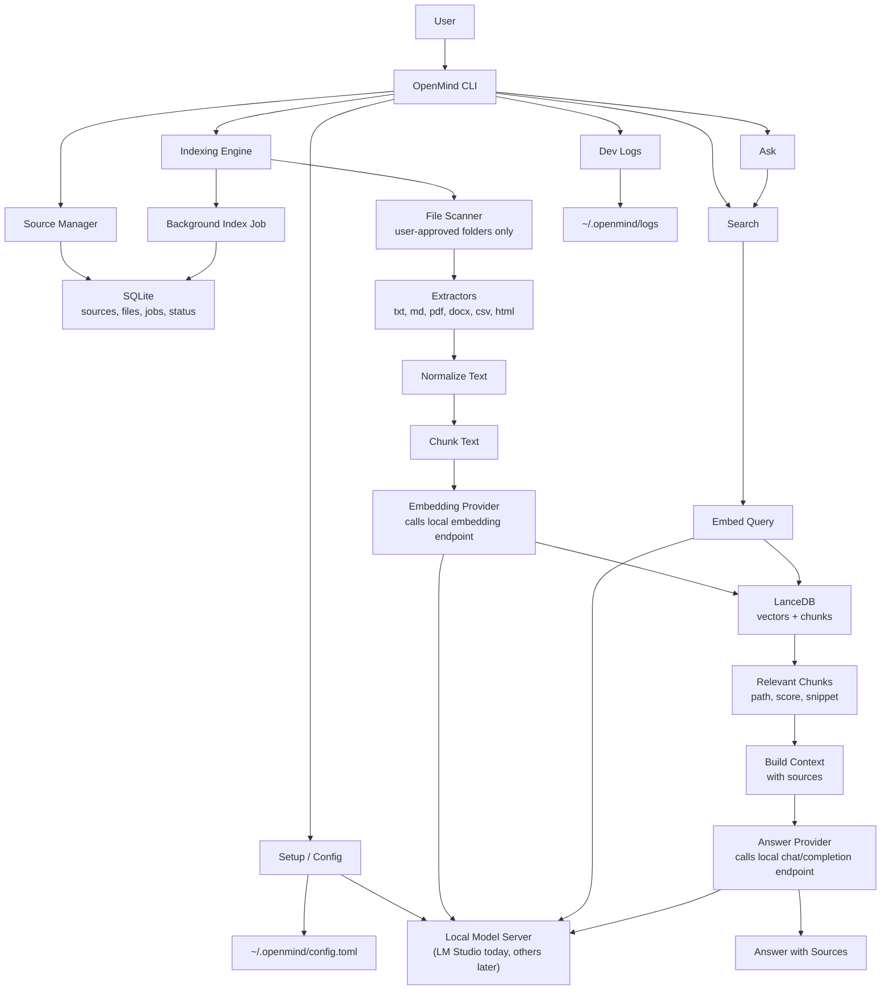

<p align="center">
  
</p>

# OpenMind Core

OpenMind is a local AI memory engine for your computer.

It indexes folders you explicitly approve, stores searchable memory locally, and lets you search or ask questions across your own files with sources attached.

OpenMind is not a chatbot, desktop UI, browser extension, cloud sync service, or agent that controls your machine. The first useful version does three things well:

```text
Index local files -> Search local memory -> Ask source-grounded questions
```

## Why OpenMind

Most AI file tools start with "upload your documents." OpenMind starts with a different premise:

Your files should stay where they are.

OpenMind is built around a simple local-first loop:

```text
Local file
  -> extract text
  -> clean text
  -> split into chunks
  -> create embeddings
  -> store in LanceDB
  -> search relevant chunks
  -> answer with sources
```

The goal is to become an open local memory layer for personal AI systems. Not the model. The memory layer.

## Current Status

OpenMind Core is early, but usable as a developer-facing CLI.

What works today:

- Local app storage under `~/.openmind`.
- User-approved folder sources.
- File extraction for common text, PDF, DOCX, CSV, Markdown, and HTML files.
- LanceDB vector storage.
- SQLite source, file, and indexing job records.
- LM Studio as the user-facing local AI provider.
- Background indexing with live progress.
- Streaming answers by default.
- Interactive ask sessions with temporary conversation memory.
- Source-grounded answers.
- Developer log inspection.

What is intentionally not here yet:

- No desktop UI.
- No browser extension.
- No cloud sync.
- No file automation.
- No plugin marketplace.
- No deleting, moving, or modifying user files.

See [FEATURES.md](FEATURES.md) for the complete shipped feature list and roadmap. See [CHANGELOG.md](CHANGELOG.md) for release notes.

## Requirements

- Python 3.11+
- `uv`
- LM Studio for local chat and embedding models
- macOS, Linux, or another Python-supported environment

OpenMind Core v0.2 uses LM Studio as its only user-facing provider. The older Sentence Transformers provider remains only as a development and test fallback.

## Install

Clone the project, enter the package directory, and install it into your Python environment.

If you already have a conda environment named `openmind`:

```bash
cd openmind-core
conda activate openmind
uv pip install -e ".[dev]"
pytest
```

`uv pip install` detects the activated conda environment and installs the packages into it, while still using uv's fast resolver and installer.

If you want uv to manage the environment itself:

```bash
cd openmind-core
uv sync --all-extras
uv run pytest
```

Useful dependency commands:

```bash
uv lock
uv sync --all-extras
uv pip install -e ".[dev]"
```

## Quick Start

Start the LM Studio local server first. In LM Studio, open the Developer tab and start the server, or run:

```bash
lms server start
```

Then run first-time setup:

```bash
openmind setup
```

Setup will:

1. Initialize `~/.openmind`.
2. Check that LM Studio is reachable.
3. Let you choose LM Studio as the provider.
4. List available chat and embedding models.
5. Load the selected models.
6. Ask which folders to index.
7. Start background indexing.

Watch indexing progress:

```bash
openmind index status
```

The live status table includes an `Already indexed` count for unchanged files that were indexed before and are still accessible.

Search your local memory:

```bash
openmind search "holiday plan"
```

Ask a question with sources:

```bash
openmind ask "What documents do I have about the cabin trip?"
```

Start an interactive ask session:

```bash
openmind ask
```

## CLI Reference

Normal users should start with:

```bash
openmind setup
```

Lower-level initialization:

```bash
openmind init
openmind status
openmind flush
openmind flush --dry-run
openmind flush --yes
openmind flush --yes --include-sources
openmind uninstall
openmind uninstall --dry-run
openmind uninstall --yes
openmind uninstall --yes --package
```

Source management:

```bash
openmind source add ~/Documents
openmind source list
openmind source remove <source_id>
```

If a folder was already added, OpenMind tells you it is already registered and reports indexed files that are already accessible.

Indexing:

```bash
openmind index
openmind index start
openmind index status
openmind index status --once
openmind index pause
openmind index resume
openmind index stop
```

If an unchanged file was indexed before, OpenMind reports it as already indexed and keeps it available for search and ask.

OpenMind uses file path, size, modified time, and content hash to avoid unnecessary work. Unchanged files are not extracted, embedded, or stored again. If a file's metadata changes, OpenMind checks the content hash and only re-indexes when the content actually changed.

Search:

```bash
openmind search "holiday plan"
openmind search "OAuth redirect issue" --limit 10
```

Ask:

```bash
openmind ask "What do my files say about the cabin trip?"
openmind ask "What do my files say about the cabin trip?" --no-stream
openmind ask "What do my files say about the cabin trip?" --show-thinking
openmind ask "What do my files say about the cabin trip?" --limit 8
openmind ask
```

Interactive ask commands:

```text
/clear  reset the current session memory
/exit   leave the chat
/quit   leave the chat
```

LM Studio provider commands:

```bash
openmind provider status
openmind models list
openmind models load
openmind models load <model_key>
openmind models update
openmind models update --no-load
```

Developer logs:

```bash
openmind dev logs
openmind dev logs --no-follow --lines 40
openmind dev logs --log all
openmind dev logs --log index
openmind dev logs --lm-studio
```

## LM Studio Integration

OpenMind talks to LM Studio at:

```text
http://localhost:1234
```

It uses LM Studio's native REST API for model setup:

```text
GET  /api/v1/models
POST /api/v1/models/load
```

It uses OpenAI-compatible endpoints for inference:

```text
POST /v1/chat/completions
POST /v1/responses
POST /v1/embeddings
```

OpenMind stores separate model choices because chat and embeddings are different jobs:

```toml
[provider]
name = "lmstudio"
base_url = "http://localhost:1234"
api_token_env = "LM_API_TOKEN"

[models]
chat_model = "selected-chat-model-key"
embedding_model = "selected-embedding-model-key"

[indexing]
auto_start_after_setup = true
background = true
```

To change saved models later, run:

```bash
openmind models update
```

OpenMind will ask for the provider, fetch the latest LM Studio model list, let you choose a chat model and embedding model, save the new config, and load the selected models by default.

When loading or updating models, OpenMind checks LM Studio first and skips models that are already loaded.

If LM Studio is not running, OpenMind exits with a clear message instead of a Python traceback.

## Architecture Choices

OpenMind keeps the architecture intentionally simple. Each technology has one simple job.

### High-Level Overview

OpenMind is the memory engine and CLI. It does not use LM Studio's chat interface, or any other provider's chat UI. It calls a local model server endpoint to reach downloaded models.

Today that local model server is LM Studio. Later, the same provider layer can support other local or OpenAI-compatible servers.



### SQLite

SQLite is used for **project state and metadata**, not the AI memory itself.

SQLite stores:

- sources and folders the user added
- file paths and file hashes
- indexing status
- indexing progress
- config and local state
- failed files or skipped files
- background job info

Why SQLite:

- it is local and embedded
- it needs no separate server
- it is reliable for small structured records
- it makes indexing progress easy to inspect and resume

### LanceDB

LanceDB is used for **searchable AI memory**.

LanceDB stores:

- extracted text chunks
- embeddings and vectors
- chunk metadata
- source paths for search results and answers

Why LanceDB:

- it runs locally from a directory path
- it avoids a separate vector database server
- it is designed for vector search
- it keeps OpenMind's memory layer portable

Simple way to think about it:

> **SQLite keeps track of what OpenMind is doing. LanceDB stores what OpenMind knows.**

### Model Provider

OpenMind uses a model provider abstraction for embeddings and answers.

In v0.2, the only implemented provider is LM Studio. OpenMind talks to LM Studio's local server endpoint; it does not use the LM Studio chat interface.

OpenMind uses the provider endpoint for:

- embedding local file chunks
- embedding search queries
- generating source-grounded answers
- streaming answer tokens in ask mode

Why LM Studio first:

- it runs local models on the user's machine
- it exposes a local API server
- it supports OpenAI-compatible chat and embedding endpoints
- it lets OpenMind stay local-first without owning model runtime complexity

Future providers can fit behind the same layer, such as Ollama, llama.cpp, or another OpenAI-compatible local endpoint.

### Typer and Rich

Typer powers the CLI. Rich powers readable terminal output.

Why they are used:

- Typer keeps commands small and type-friendly
- Rich makes tables, progress views, and errors easier to read
- the CLI stays usable before any desktop or web UI exists

### uv

uv is used for dependency management and development setup.

Why uv:

- fast installs and dependency resolution
- works with an existing conda environment
- supports reproducible lockfiles
- keeps contributor setup simple

## Supported Files

OpenMind currently indexes:

```text
.txt
.md
.pdf
.docx
.csv
.html
```

OpenMind is document-first by default. It does not index source code, JSON config files, package metadata, app asset catalogs, or other low-level project internals unless a future opt-in mode is added. High-level project documents such as `README.md`, Markdown notes, PDFs, DOCX files, CSVs, and HTML docs can still be indexed.

It ignores noisy folders such as:

```text
.git
node_modules
venv
.venv
.env
__pycache__
dist
build
.cache
target
coverage
Assets.xcassets
hidden folders
```

Image files are included in the sample `data/` directory for realism, but v0.2 does not index image content or run OCR.

## Search Mode

Search does not require a chat model. It embeds the query with the selected LM Studio embedding model, searches LanceDB, and returns paths, scores, and snippets.

Example:

```bash
openmind search "cabin trip checklist"
```

Output is shaped like:

```text
1. ~/Documents/Holiday/checklist.md
   Score: 0.91
   Snippet: The packing checklist includes...
```

If search is bad, answers will be bad. OpenMind treats search quality as the foundation.

## Ask Mode

Ask is search plus an answer model:

```text
question
  -> retrieve relevant chunks
  -> build grounded context
  -> stream answer from LM Studio
  -> show sources
```

Answers stream by default:

```bash
openmind ask "What do my files say about the cabin trip?"
```

Disable streaming when needed:

```bash
openmind ask "What do my files say about the cabin trip?" --no-stream
```

Show provider-returned thinking or reasoning when the selected LM Studio model exposes it:

```bash
openmind ask "What do my files say about the cabin trip?" --show-thinking
```

If the model does not return explicit thinking or reasoning, OpenMind says so and still returns the answer with sources.

Bare `openmind ask` starts a chat-like session:

```bash
openmind ask
```

Session history is held in memory while the process is open, so follow-up questions can refer to earlier turns. The session is discarded when you exit.

## Background Indexing

Start indexing in the background:

```bash
openmind index start
```

Watch a live table:

```bash
openmind index status
```

Print status once:

```bash
openmind index status --once
```

Pause, resume, or stop:

```bash
openmind index pause
openmind index resume
openmind index stop
```

Indexing has two phases:

1. Discovery: scan enabled sources and count supported files.
2. Indexing: extract, chunk, embed, and store chunks while updating SQLite progress.

The live table shows:

- Job id
- State
- Files discovered
- Files processed
- Files indexed
- Files skipped
- Files failed
- Chunks created
- Progress percentage
- Current file

Pause and stop take effect after the current file finishes. If a file is already inside a slow extraction or embedding request, the worker checks the requested state before moving to the next file.

## Logs

OpenMind writes structured logs to:

```text
~/.openmind/logs/openmind.log
```

Index worker logs are written to:

```text
~/.openmind/logs/index-<job-id>.log
```

Watch logs:

```bash
openmind dev logs
```

Show recent logs once:

```bash
openmind dev logs --no-follow --lines 40
```

Watch all OpenMind logs:

```bash
openmind dev logs --log all
```

Watch only index worker logs:

```bash
openmind dev logs --log index
```

Watch LM Studio logs through its CLI:

```bash
openmind dev logs --lm-studio
```

That command runs:

```bash
lms log stream
```

## Local Storage

OpenMind stores app data under `~/.openmind` by default:

```text
~/.openmind/
├── config.toml
├── openmind.sqlite
├── lancedb/
└── logs/
```

For development and tests, use a separate home:

```bash
OPENMIND_HOME=/tmp/openmind-dev openmind status
```

Reset indexed memory without uninstalling:

```bash
openmind flush
```

This clears OpenMind's indexed memory and indexing state, including SQLite file records, index jobs, LanceDB vectors/chunks, and log files. It keeps `config.toml` and saved source folders by default, so you can run `openmind index start` again from a clean memory state. To also clear saved source folder records:

```bash
openmind flush --yes --include-sources
```

Flush never deletes the actual files or folders you indexed.

Remove OpenMind-owned local data:

```bash
openmind uninstall
```

This deletes the OpenMind app home, including `config.toml`, `openmind.sqlite`, `lancedb/`, and `logs/`. It does not delete user source folders, LM Studio, or downloaded models.

To remove the installed package from the current Python environment in the same command:

```bash
openmind uninstall --yes --package
```

## Test Data

This repo includes a small `data/` folder with notes, Markdown, JSON, CSV, HTML, JavaScript, a sample PDF, and images. Only supported document-first formats are indexed by default.

Try it:

```bash
openmind source add ./data
openmind index start
openmind index status
openmind search "holiday plan"
```

## Project Structure

```text
openmind/
├── cli/
├── core/
├── sources/
├── extractors/
├── ingestion/
├── embeddings/
├── storage/
├── retrieval/
├── llm/
└── providers/
```

The design is deliberately boring inside: each stage has a small job, and the provider layer is replaceable without rewriting ingestion, storage, or retrieval.

## Development

Install development dependencies:

```bash
uv pip install -e ".[dev]"
```

Run tests:

```bash
pytest
```

Or with uv:

```bash
uv run pytest
```

Keep docs in sync when behavior changes:

- Update [FEATURES.md](FEATURES.md) when a feature lands.
- Update [CHANGELOG.md](CHANGELOG.md) for user-facing release notes.
- Update [TECHNICAL_SPEC.md](TECHNICAL_SPEC.md) when architecture, schema, or interfaces change.
- Update this README when normal user workflow changes.

## Roadmap

Near-term work:

- Better indexing error inspection.
- Failed-file retry commands.
- Rebuild index command.
- Source enable and disable.
- Hybrid keyword plus vector search.
- Better snippets and citations.
- OCR for screenshots and scanned PDFs.
- Persistent chat sessions.
- Local API for future UI clients.
- Additional providers after LM Studio is solid.

The full roadmap lives in [FEATURES.md](FEATURES.md).

## Contributing

OpenMind is early and intentionally small. Good contributions make the core more trustworthy without adding premature surface area.

Start with [CONTRIBUTING.md](CONTRIBUTING.md).

## License

MIT. See [LICENSE](LICENSE).
